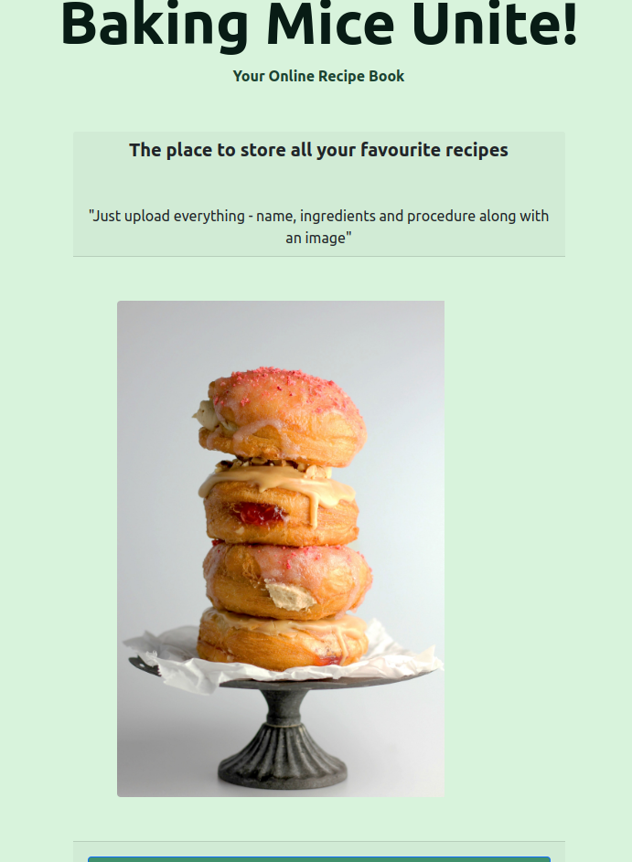

# BakingMiceUnite
This Project can be found here https://baking-mice-unite.onrender.com/

### About Baking Mice Unite
This is a fullstack application- a social media style online recipe book where the user can log in and post,read and delete all their recipes as well as looking at other users recipes.

The app is structured in a way, that the user uploads their recipes to a category- so at a later stage, they can browse the recipes they have in, let's say, soups and stews.

### How It Is Done
Techs used: HTML5, CSS3, JavaScript, Node.js, Express.js, EJS, MongoDB/Mongoose, Passport and Bootstrap.

The first step to get this application running, is to open the command line in the folder of the app and type in following command : npm install.

The second step that is required it to set up the Database - MongoDB and using Mongoose for Schemas. Working on the backend was put under the guideline of MVC - Model, View, Controller and implementing Routes. The DB String needs to be used in an env file.

### Lessons Learned
- Graphical interface can do with a revamp. In future it would be nice to reactify the frontend
- Likes could be limited to once per user/post
- Future plans involve the ability to look at other users profiles and send friend requests
- Therefore the feed giving priority to friends posts showing up first
- Implementation of ability to copy another users recipe and save in your own recipes
